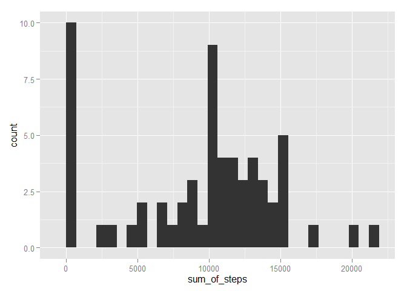
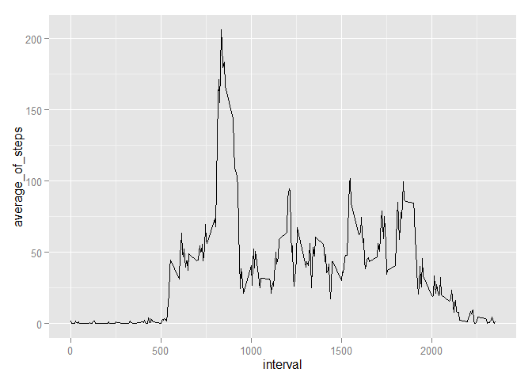
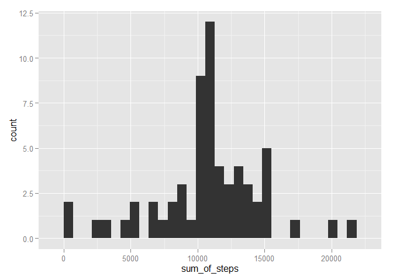
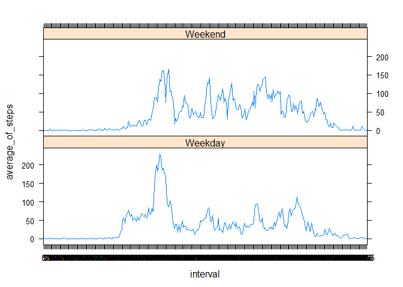

# Reproducible Research: Peer Assessment 1


## Loading and preprocessing the data

Testing whether the zip-file exists in the current working directory otherwise downloading it to the current working directory. Afterwards unzipping the data.

```r
if(!file.exists("./activity.zip")) {
        fileURL <- "https://d396qusza40orc.cloudfront.net/repdata%2Fdata%2Factivity.zip"
        download.file(fileURL,destfile="./activity.zip")        
}
if(!file.exists("./activity.csv")) {
        unzip("./activity.zip",exdir=".")        
}
```

Read the csv-file into a data frame called rawdata including the rawdata.

```r
rawdata <-read.csv(file="activity.csv",header=TRUE)
```

Converting the date column into a date-format and interval column as factor.

```r
rawdata$date<-as.Date(rawdata$date,"%Y-%m-%d")
rawdata$interval<-as.factor(rawdata$interval)
```

## What is mean total number of steps taken per day?

1. Total number of steps per day

```r
library(dplyr)
```

```
## Warning: package 'dplyr' was built under R version 3.1.3
```

```
## 
## Attaching package: 'dplyr'
## 
## The following object is masked from 'package:stats':
## 
##     filter
## 
## The following objects are masked from 'package:base':
## 
##     intersect, setdiff, setequal, union
```

```r
Daily_sum_of_steps <- rawdata %>% group_by(date) %>% summarize(sum_of_steps = sum(steps,na.rm=TRUE))
Daily_sum_of_steps
```

```
## Source: local data frame [61 x 2]
## 
##          date sum_of_steps
## 1  2012-10-01            0
## 2  2012-10-02          126
## 3  2012-10-03        11352
## 4  2012-10-04        12116
## 5  2012-10-05        13294
## 6  2012-10-06        15420
## 7  2012-10-07        11015
## 8  2012-10-08            0
## 9  2012-10-09        12811
## 10 2012-10-10         9900
## ..        ...          ...
```


2.  Histogram of Total number of steps per day
Using ggplot2 graphics system the Historgram for the total number of steps per day is the following:

```r
library(ggplot2)
```

```
## Warning: package 'ggplot2' was built under R version 3.1.3
```

```r
qplot(sum_of_steps,data=Daily_sum_of_steps)
```

 


3. Calculate the mean and median for the total number of steps per day

The mean of the total number of steps per day is:

```r
mean(Daily_sum_of_steps$sum_of_steps)
```

```
## [1] 9354.23
```
The median of the total number of steps per day is:

```r
median(Daily_sum_of_steps$sum_of_steps)
```

```
## [1] 10395
```

## What is the average daily activity pattern?

1. Make a time series plot (i.e. type = "l") of the 5-minute interval (x-axis) and the average number of steps taken, averaged across all days (y-axis)

Calculating the average of each 5-min interval across all days.

```r
Average_daily_activity<-rawdata %>% group_by(interval) %>% summarize(average_of_steps = mean(steps,na.rm=TRUE))
Average_daily_activity
```

```
## Source: local data frame [288 x 2]
## 
##    interval average_of_steps
## 1         0        1.7169811
## 2         5        0.3396226
## 3        10        0.1320755
## 4        15        0.1509434
## 5        20        0.0754717
## 6        25        2.0943396
## 7        30        0.5283019
## 8        35        0.8679245
## 9        40        0.0000000
## 10       45        1.4716981
## ..      ...              ...
```

Timeseries-Plot:

```r
Average_daily_activity$interval<-as.numeric(as.character(Average_daily_activity$interval))
g<-ggplot(Average_daily_activity,aes(interval,average_of_steps))
p<-g+geom_line()
print(p)
```

 

2. Which 5-minute interval, on average across all the days in the dataset, contains the maximum number of steps?

```r
filter(Average_daily_activity, average_of_steps == max(Average_daily_activity$average_of_steps))
```

```
## Source: local data frame [1 x 2]
## 
##   interval average_of_steps
## 1      835         206.1698
```
## Imputing missing values

1. Calculate and report the total number of missing values in the dataset (i.e. the total number of rows with NAs)

```r
sum(is.na(rawdata$steps))
```

```
## [1] 2304
```

2. Devise a strategy for filling in all of the missing values in the dataset. The strategy does not need to be sophisticated. For example, you could use the mean/median for that day, or the mean for that 5-minute interval, etc.

The NA values will be replaced with the 5-min interval mean over all days, previously stored in "Average_daily_activity"" - data frame. See the data.


```r
Average_daily_activity
```

```
## Source: local data frame [288 x 2]
## 
##    interval average_of_steps
## 1         0        1.7169811
## 2         5        0.3396226
## 3        10        0.1320755
## 4        15        0.1509434
## 5        20        0.0754717
## 6        25        2.0943396
## 7        30        0.5283019
## 8        35        0.8679245
## 9        40        0.0000000
## 10       45        1.4716981
## ..      ...              ...
```

3. Create a new dataset that is equal to the original dataset but with the missing data filled in.

Splitting the data into on NA-values:

```r
splitrawdata<-split(rawdata,is.na(rawdata$steps))
nafalserawdata<-splitrawdata[[1]]
natruerawdata<-splitrawdata[[2]]
```

Merging the Average-daily_activity data with the NA-Values in natruerawdata, creating a new data set called "filldata"

```r
namergerawdata<-merge(natruerawdata,Average_daily_activity, by.x="interval",by.y="interval",all.x=TRUE)
namergerawdata<-namergerawdata %>% select(-steps) %>% rename(steps=average_of_steps)
filldata<-rbind(nafalserawdata,namergerawdata)
head(filldata)
```

```
##     steps       date interval
## 289     0 2012-10-02        0
## 290     0 2012-10-02        5
## 291     0 2012-10-02       10
## 292     0 2012-10-02       15
## 293     0 2012-10-02       20
## 294     0 2012-10-02       25
```
Number of NAs in new dataset:

```r
sum(is.na(filldata$steps))
```

```
## [1] 0
```

4. Make a histogram of the total number of steps taken each day and Calculate and report the mean and median total number of steps taken per day. Do these values differ from the estimates from the first part of the assignment? What is the impact of imputing missing data on the estimates of the total daily number of steps?

Histogram of the total number of steps taken each day:

```r
Daily_sum_of_steps_filled <- filldata %>% group_by(date) %>% summarize(sum_of_steps = sum(steps,na.rm=TRUE))
qplot(sum_of_steps,data=Daily_sum_of_steps_filled)
```

 

The mean of the total number of steps per day with filled-in data is:

```r
mean(Daily_sum_of_steps_filled$sum_of_steps)
```

```
## [1] 10766.19
```
The median of the total number of steps per day with filled-in data is:

```r
median(Daily_sum_of_steps_filled$sum_of_steps)
```

```
## [1] 10766.19
```

The Values differ from the values without filling in. The median and mean goes increased when data is imputed. Also there is no difference now between the median and mean, indicating that there is little skew in the distribution.


## Are there differences in activity patterns between weekdays and weekends?

1. Create a new factor variable in the dataset with two levels - "weekday" and "weekend" indicating whether a given date is a weekday or weekend day.

The inidcator variable is called "weekday_weekend""

```r
filldata$weekday<-weekdays(filldata$date)
filldata$weekday_weekend<-as.factor(ifelse(filldata$weekday %in% c("Saturday","Sunday"),"Weekend","Weekday"))
str(filldata)
```

```
## 'data.frame':	17568 obs. of  5 variables:
##  $ steps          : num  0 0 0 0 0 0 0 0 0 0 ...
##  $ date           : Date, format: "2012-10-02" "2012-10-02" ...
##  $ interval       : Factor w/ 288 levels "0","5","10","15",..: 1 2 3 4 5 6 7 8 9 10 ...
##  $ weekday        : chr  "Tuesday" "Tuesday" "Tuesday" "Tuesday" ...
##  $ weekday_weekend: Factor w/ 2 levels "Weekday","Weekend": 1 1 1 1 1 1 1 1 1 1 ...
```

2. Make a panel plot containing a time series plot (i.e. type = "l") of the 5-minute interval (x-axis) and the average number of steps taken, averaged across all weekday days or weekend days (y-axis). See the README file in the GitHub repository to see an example of what this plot should look like using simulated data.


```r
Weekend_weekday_averages<-filldata %>% group_by(weekday_weekend,interval) %>% summarize(average_of_steps = mean(steps,na.rm=TRUE))
library(lattice)
```

```
## Warning: package 'lattice' was built under R version 3.1.3
```

```r
xyplot(average_of_steps ~ interval | weekday_weekend,data=Weekend_weekday_averages, type="l",layout=(c(1,2)))
```

 
